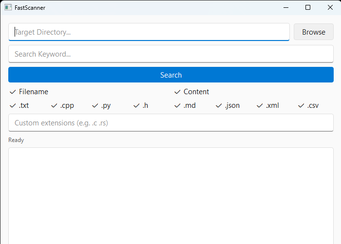

# FastScanner


Fast multi-threaded file search tool for Windows (GUI + CLI), built with C++17 and Qt6.



## Benchmarks

| Tool        | Time (~1700 small files) |
|-------------|--------------------|
| FastScanner | ~16 ms             |
| ripgrep     | ~40 ms             |
| grep        | ~1590 ms           |

*Measured with PowerShell Measure-Command on Windows 11, averaged over multiple runs.*
*FastScanner is optimized for scanning many small to medium files in parallel. For single large file, single-threaded tools with optimized search algorithms (e.g. grep) may perform better.*

## Features

- Multi-threaded directory scanning with thread pool
- Zero-copy file search using memory mapping
- Filename and content search modes
- Configurable extension filter with custom input
- Real-time result display via callback
- Right-click actions: Open File, Open in Explorer, Copy Path
- Unicode path support (Korean filenames tested)

## Download

See [Releases](https://github.com/hongsumin-cs/FastScanner/releases/tag/v1.0.0) for Windows builds (GUI & CLI).

## Usage

### GUI
Run `FastScannerGUI.exe`, select a directory, enter a keyword, and press Search.
Right-click a result to open the file, reveal it in Explorer, or copy its path.

### CLI
```
FastScannerCLI.exe <directory> <keyword> [option]

Options:
  -n    Search file names only
  -c    Search file contents only
  (default: both)
```

Example:
```
FastScannerCLI.exe C:\Users\me\Documents report -c
```

## Development Notes

- **Abort() on scan**: Exceptions due to junction points from worker thread caused terminate. Fixed by wrapping try-catch and ensuring the catch block itself doesn't throw. 
- **Unicode Exception**: Paths with Korean filenames crashed due to implicit string() conversion. Fixed by keeping paths as std::filesystem::path and using u8string()&CreateFileW.
- **Interleaved CLI output**: Multiple threads writing via operator<< produced mixed lines. Fixed by building the full string before a single cout call.
- **Premature scan completion**: The main thread returned when the task queue was empty, but workers scanning directories could still push new tasks. Fixed by counting active workers and waiting on a condition variable until both the queue is empty and no worker is running.

## Build from Source

Requirements: CMake 3.16+, Qt 6.x, MSVC 2022

```
git clone https://github.com/hongsumin-cs/FastScanner.git
cd FastScanner
cmake -B build -DCMAKE_PREFIX_PATH="C:/Qt/6.x.x/msvc2022_64"   # Qt install path
cmake --build build --config Release
```

## Architecture

### Core design

- **Unified task model** — Directories and files are the same ScanTask type. A worker that scans a directory pushes discovered directories and files back into the shared queue. The workload self-balances across threads.
- **Batched queue access** — Workers pop up to 64 tasks per lock acquisition, and directory scans push discovered tasks in batches of 64, reducing lock contention on the shared queue.
- **Completion detection** — The main thread waits on a condition variable until the queue is empty and no worker is active, since an empty queue alone doesn't mean completion (a running worker may still push new tasks).
- **Dual result** — `setOnResultFound()` streams results in real time, while `getResults()` returns the full list after completion for statistics.

### Source layout

- `FastScanner.h / .cpp` — core engine (thread pool, task queue, mmap search)
- `main.cpp` — CLI frontend
- `gui_main.cpp` — Qt GUI frontend

## Roadmap

- [ ] Cross-platform support
- [ ] Separate matched file count
- [ ] Replace content search with Boyer-Moore algorithm for few large files
- [ ] Parallel chunk-based search within large files